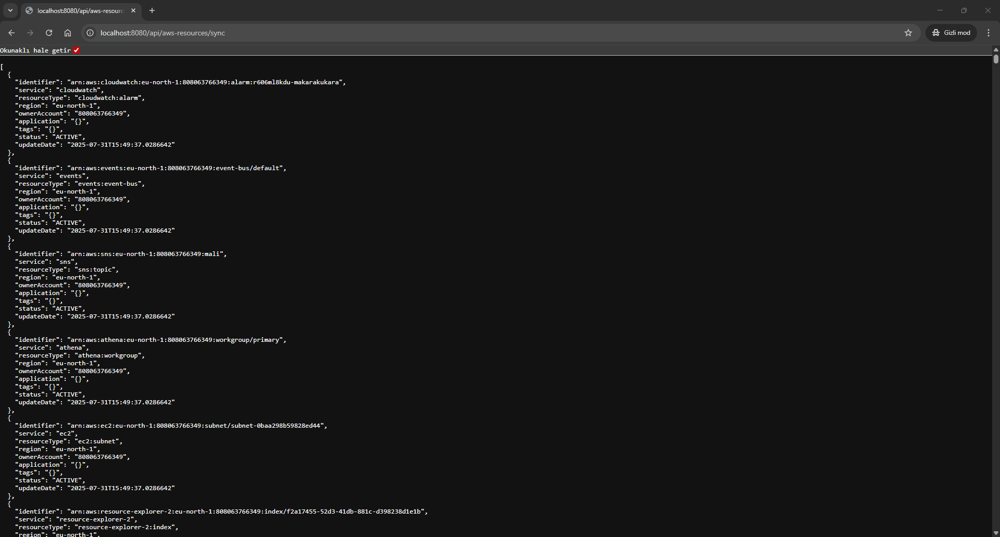
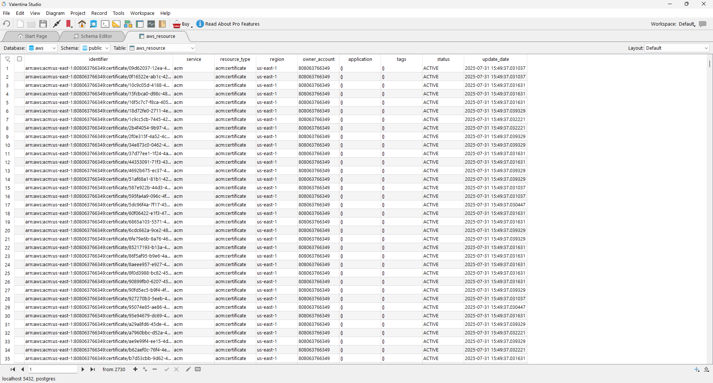
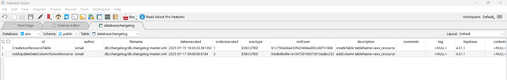

# AWS Resource Explorer Data Sync (Java Spring Boot)

## 📝 Project Description

This project periodically retrieves all resources accessible via AWS Resource Explorer and stores them in a PostgreSQL database. Developed with Spring Boot, the application refreshes the data every hour to keep it up to date. The data processing is executed in parallel using multithreading.

## 🚀 Features

- Retrieve resource data from AWS Resource Explorer  
- Database operations with PostgreSQL via Docker container  
- Database version control with Liquibase  
- Automatic hourly data refresh  
- Multithreaded parallel data processing  
- RESTful service architecture using Spring Boot

## 🛠️ Technologies Used

| Technology       | Description                          |
|------------------|--------------------------------------|
| Java 21          | Primary programming language         |
| Spring Boot      | Application framework                |
| AWS SDK          | Access to AWS Resource Explorer API  |
| PostgreSQL       | Database                             |
| Liquibase        | Database migration/version control   |
| Docker           | Containerized PostgreSQL setup       |
| Maven            | Dependency management                |

## ⚙️ Setup and Running

### 1. Clone the Repository

```bash
git clone https://github.com/ismailbeli/AWS_SaveResources.git
cd AWS_SaveResources
```

### 2. Configure `application.properties`

Edit `src/main/resources/application.properties` and add the following:

```properties
aws.access.key=YOUR_AWS_ACCESS_KEY
aws.secret.key=YOUR_AWS_SECRET_KEY

spring.datasource.url=jdbc:postgresql://localhost:5432/YOUR_DB_NAME
spring.datasource.username=postgres
spring.datasource.password=YOUR_DB_PASSWORD
```

> ⚠️ Make sure this file is listed in your `.gitignore` to avoid committing sensitive data.

Alternatively, you can define these via terminal environment variables:

```bash
export AWS_ACCESS_KEY=your_aws_access_key
export AWS_SECRET_KEY=your_aws_secret_key
export DB_PASSWORD=your_postgres_password
```

### 3. Set Up PostgreSQL with Docker

1. Open **Docker Desktop**.
2. Navigate to the **Containers** or **Images** tab.
3. Click **"Create Container"** or **"Run"** from a PostgreSQL image (e.g., `postgres:15`).
4. Configure container settings:
   - **Port**: `5432:5432`
   - **Environment Variables**:
     - `POSTGRES_DB=YOUR_DB_NAME`
     - `POSTGRES_USER=postgres`
     - `POSTGRES_PASSWORD=YOUR_DB_PASSWORD`
5. Start the container.

After it's up and running, your Spring Boot app can connect to the database at `localhost:5432`.


### 4. Run the Spring Boot Application

```bash
./mvnw spring-boot:run
```
## ▶️ First-Time Sync Trigger

After starting the application, initiate the first data synchronization by visiting:

```
http://localhost:8080/api/aws-resources/sync
```

You can open this URL in your browser or trigger it using tools like Postman or curl.



## 🗃️ Sample AWS Resource Data View

The data retrieved from AWS Resource Explorer is stored in PostgreSQL. Below is an example of the resource list viewed via a database client:



## 🔁 Liquibase Migration History

Liquibase automatically manages schema changes and keeps track of all migrations applied to the database.



## 🔁 Data Refresh Process

- The application fetches data from AWS Resource Explorer every hour.
- New resources are inserted into the database.
- Existing resources are updated, and missing ones are marked as inactive.
- The fetch operation runs in parallel using multithreading.

## 🔐 Security Notice

- **AWS Access Key** and **Secret Key** should never be committed to the repository.
- `application.properties` must be included in `.gitignore`.
- It's recommended to use environment variables for sensitive credentials.

## 📂 Project Structure

```
aws-resource-explorer/
├── src/
│   └── main/
│       ├── java/
│       │   └── com/example/
│       │       ├── controller/
│       │       ├── model/
│       │       ├── repository/
│       │       ├── scheduler/
│       │       └── service/
│       └── resources/
│           ├── application.properties
│           └── db/changelog/
├── images/
├── pom.xml
└── README.md
```

## 📄 License

See the [LICENSE](./LICENSE) file for details.
